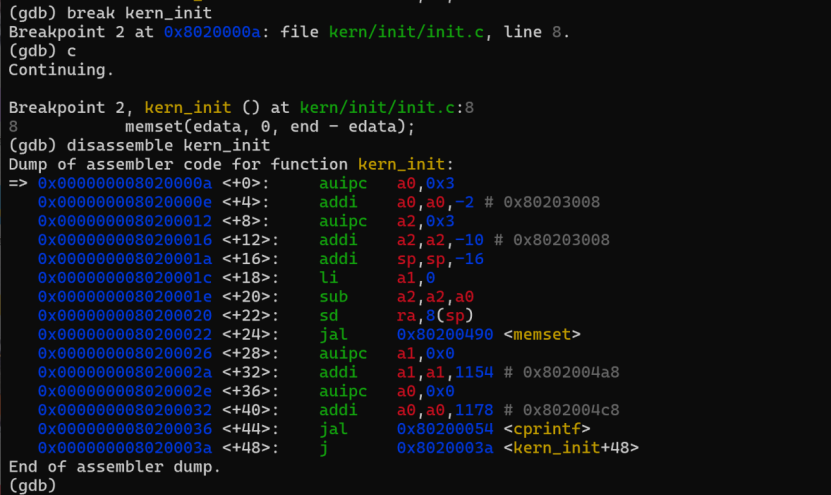

# 实验报告：RISC-V 内核启动流程分析与 GDB 调试验证

## 一、实验环境

* **平台**：QEMU（RISC-V 64 模拟器）
* **调试工具**：GDB
* **交叉编译器**：riscv64-linux-gnu-gcc
* **Bootloader 固件**：OpenSBI
* **内核镜像文件**：`ucore.bin`
* **关键内存地址**：

  * 复位地址：`0x1000`
  * SBI 启动地址：`0x80000000`
  * 内核加载地址：`0x80200000`

---

## 二、实验内容与过程

---

### 练习1：理解内核启动中的程序入口操作

阅读 kern/init/entry.S内容代码，结合操作系统内核启动流程，说明指令 la sp, bootstacktop 完成了什么操作，目的是什么？ tail kern_init 完成了什么操作，目的是什么？

#### 操作系统内核启动流程概述

在分析 entry.S 代码之前，需要了解操作系统内核启动的整体流程，OpenSBI作为 RISC-V 平台的标准引导固件，提供了操作系统内核与硬件之间的中间层。启动流程如下：

1. **引导加载阶段**：硬件启动后，OpenSBI 固件首先运行在机器模式（M-mode），OpenSBI被加载到物理内存以物理地址 0x80000000 开头的区域上，完成硬件上电初始化和内核加载工作

2. **内核交接阶段**：OpenSBI 将内核映像加载到内存指定位置（ 0x80200000），并通过寄存器传递启动参数：
   - **a0**：当前 CPU 的硬件线程 ID
   - **a1**：设备树 blob（DTB）的物理地址

3. **入口点跳转**：OpenSBI 将控制权转移到监督者模式（S-mode），跳转到内核入口点 `kern_entry`

4. **环境初始化**：在 `kern_entry` 中设置栈指针，建立基本运行环境，这部分工作就是`entry.S`主要要做的

5. **内核初始化**：进入 `kern_init` 函数，完成系统各模块初始化

6. **系统运行**：初始化完成后，操作系统进入正常运行状态


#### 1. `entry.S` 完整代码分析

```assembly
#include <mmu.h>
#include <memlayout.h>

    .section .text,"ax",%progbits
    .globl kern_entry
kern_entry:
    la sp, bootstacktop
    tail kern_init

.section .data
    # .align 2^12
    .align PGSHIFT
    .global bootstack
bootstack:
    .space KSTACKSIZE
    .global bootstacktop
bootstacktop:
```

##### 1. 头文件包含

```assembly
#include <mmu.h>
#include <memlayout.h>
```

- **包含内存管理相关定义**：引入内存管理单元（MMU）和内存布局的定义文件
- **提供常量定义**：包含页面大小、内存区域划分等内核启动所需的内存相关常量
- **确保内存配置一致性**：保证汇编代码与C代码使用相同的内存配置参数

##### 2. 代码段定义

```assembly
.section .text,"ax",%progbits
```

- **.text**：指定后续代码位于文本段（代码段），这是可执行的程序代码区域
- **"ax"**：段属性标志组合
  - **a**：可分配（allocatable），表示该段在程序加载时需要分配内存空间
  - **x**：可执行（executable），表明该段包含可执行的机器指令
- **%progbits**：表明该段包含程序数据，与包含调试信息的nobits相对

##### 3. 内核入口点声明

```assembly
.globl kern_entry
kern_entry:
```

- **.globl kern_entry**：将 `kern_entry` 声明为全局符号，使其对其他编译单元可见
- **kern_entry:**：定义内核入口点标签，这是操作系统内核执行的起始位置，也是引导程序跳转的目标地址

##### 4. `la sp, bootstacktop` - 内核栈初始化

将 `bootstacktop` 符号对应的地址加载到 `sp`（栈指针）寄存器中。


##### 5. `tail kern_init` - 操作系统入口跳转

使程序执行流跳转到 `kern_init` 函数的第一条指令。

这两部分内容将在后续进行详细叙述。


##### 6. 数据段定义

```assembly
.section .data
    # .align 2^12
    .align PGSHIFT
    .global bootstack
bootstack:
    .space KSTACKSIZE
    .global bootstacktop
bootstacktop:
```

##### 段定义说明
- **.section .data**：定义数据段，存放初始化的全局变量和内核栈空间

##### 内存对齐设置
- **.align PGSHIFT**：按页面大小边界对齐，`PGSHIFT` 通常为12，对应4KB页面对齐
- **注释说明**：`# .align 2^12` 明确指出了对齐的具体数值

##### 栈空间分配
- **.global bootstack**：声明 `bootstack` 为全局符号，可在其他文件中引用
- **bootstack:**：内核栈起始位置标签，标识栈空间的开始地址
- **.space KSTACKSIZE**：分配 `KSTACKSIZE`（8192字节）的连续内存空间作为内核栈

##### 栈顶定义
- **.global bootstacktop**：声明 `bootstacktop` 为全局符号
- **bootstacktop:**：内核栈顶部位置标签，标识栈空间的结束地址

#### 2. `la sp, bootstacktop` - 内核栈初始化

##### 指令功能
将 `bootstacktop` 符号对应的地址加载到 `sp`（栈指针）寄存器中。

##### 设计目的
- **初始化内核栈**：为内核模式操作提供栈空间支持
- **栈顶定位**：由于栈在内存中从高地址向低地址增长，初始时需要指向栈的顶部
- **空间分配**：通过数据段中按页面对齐分配的 `bootstack` 栈空间，大小为 `KSTACKSIZE = 8192` 字节（8KB）
```assembly
.section .data
    # .align 2^12
    .align PGSHIFT
    .global bootstack
bootstack:
    .space KSTACKSIZE
    .global bootstacktop
bootstacktop:
```

##### 技术细节
- **栈增长方向**：采用向下增长模式（高地址 → 低地址）
- **内存对齐**：确保栈地址按页面边界对齐，提高内存访问效率
- **大小配置**：8KB 栈空间为内核初始操作提供充足的栈深度

##### 对应机器指令
通过GBD调试得到对应的机器指令：
```assembly
0x80200000 <kern_entry>:     auipc   sp,0x3
0x80200004 <kern_entry+4>:   mv      sp,sp
```
- **auipc sp, 0x3**：
  - 将立即数 `0x3` 左移12位，然后与当前PC值相加，结果存入 sp 寄存器
  - 计算：`sp = PC + (0x3 << 12) = 0x80200000 + 0x3000 = 0x80203000`
  - 这形成了地址的高20位

- **mv sp, sp**：
  - 看起来像是空操作，但实际上可能是编译器对地址调整的优化
  - 在某些情况下，这可能用于清除地址的低12位或进行其他调整

同样使用 GDB 进行查看bootstacktop和 bootstack 符号地址，得到：
```gbd
(gdb) info address bootstacktop
Symbol "bootstacktop" is at 0x80203000 in a file compiled without debugging.
(gdb) info address bootstack
Symbol "bootstack" is at 0x80201000 in a file compiled without debugging.
```
可以看到 bootstacktop和 bootstack 之间的栈空间为 `0x2000`，即8KB，与定义的 `KSTACKSIZE` (8192字节) 完全一致。

#### 3. `tail kern_init` - 操作系统入口跳转

##### 指令功能
使程序执行流跳转到 `kern_init` 函数的第一条指令。

##### 设计目的
- **系统启动入口**：进入操作系统的核心初始化流程
- **尾调用优化**：采用尾调用（tail call）机制，不保存返回地址到 `ra` 寄存器

##### 技术特性
- **无返回设计**：
  - `kern_init` 函数使用 `__attribute__((noreturn))` 声明
  - 表明该函数永远不会返回到调用者
  - 因此无需保存返回地址，节省栈空间和指令周期

- **执行流程**：
  - 直接跳转到 `kern_init` 开始执行
  - 不维护调用栈的返回链
  - 实现高效的上下文切换

##### 对应机器指令
同样通过GBD调试得到对应的机器指令：
```assembly
0x80200008 <kern_entry+8>:   j       0x8020000a <kern_init>
=> 0x8020000a <kern_init>:      auipc   a0,0x3
```
- **j 0x8020000a**：
  - 无条件跳转到指定地址 `0x8020000a`，这是 `kern_init` 函数的起始地址
  - 跳转指令不保存返回地址，实现尾调用优化

- **=> 0x8020000a <kern_init>:**：
  - 箭头表示程序计数器当前指向的位置，程序已成功跳转到 `kern_init` 函数
  - 下一条指令 `auipc a0, 0x3` 是 `kern_init` 函数的第一条指令


#### 总结

entry.S 文件完成了操作系统内核启动的最初阶段工作：

1. **定义内核入口点**：通过 `.globl kern_entry` 声明全局入口点，为内核执行提供明确的起始位置，这是 OpenSBI 跳转到操作系统的目标地址

2. **建立执行环境**：通过 `la sp, bootstacktop` 指令初始化栈指针，将栈顶地址加载到 sp 寄存器，为后续的函数调用和C代码执行提供必要的栈空间支持

3. **跳转主流程**：通过 `tail kern_init` 指令采用尾调用方式高效地转入内核主初始化函数，不保存返回地址，实现从汇编到C代码的平滑过渡

4. **内存管理准备**：在数据段中预分配8KB的内核栈空间，通过 `.align PGSHIFT` 确保页面边界对齐，为后续内存管理初始化奠定基础

而两条关键指令 `la sp, bootstacktop` 和 `tail kern_init` 共同构建了一个精简而高效的启动桥梁：前者建立了可靠的栈环境，确保C函数能够正确执行，后者实现了从底层汇编到高层C代码的无缝衔接，并采用尾调用优化，节省栈空间和指令周期。


### **练习二：使用 GDB 验证启动流程**
#### 复位阶段
##### 1. 启动调试环境

进入`labcode/lab1`目录，打开终端输入`make debug`以启动QEMU并等待GDB连接。随后，在另一个终端中输入`make gdb`来启动GDB并连接至QEMU。

```bash
make debug
make gdb
```


QEMU 启动并暂停在复位点等待 GDB 连接。GDB 启动后连接至目标机。

##### 2. 查看 CPU 启动位置

上图中，“0x0000000000001000 in ?? ()”表示程序当前暂停在地址0x1000处。
根据实验指导书，QEMU模拟的RISC-V处理器的复位向量地址为0x1000，处理器将从此地址开始执行复位代码，因此GDB显示程序暂停在0x1000处。
或者输入：

```bash
(gdb) info registers pc
```

结果显示：

```
pc = 0x1000
```

说明 CPU 从物理地址 `0x1000` 开始执行。

##### 3. 查看复位地址的汇编指令

在GDB中输入指令 `x/10i $pc`，查看RISC-V硬件加电后的前10条指令。由于系统刚刚启动，$pc的值即为硬件通电后的第一条指令地址，输出结果如下：

```bash
(gdb) x/10i $pc
```

输出：

```
0x1000:  auipc t0,0x0
0x1004:  addi  a1,t0,32
0x1008:  csrr  a0,mhartid
0x100c:  ld    t0,24(t0)
0x1010:  jr    t0
......
```


##### 4. 分析复位指令的功能

上述输出结果可以看到在地址 0x1010 处存在一条跳转指令，目标地址在寄存器 t0 中。我们进行单步调试，使用 info r t0 观察 t0 中的值。auipc t0,0x0 将当前 PC 保存在 t0 中，ld t0,24(t0) 将 t0 偏移 24 的地址，即 0x1018 中的数据加载到 t0 。使用 x/1xw 0x1018 查看地址 0x1018 中的数据为 0x80000000 ，执行该指令后 t0 中的数据为 0x80000000 。

| 地址     | 指令                | 功能                     |
| ------ | ----------------- | ---------------------- |
| 0x1000 | `auipc t0,0x0`    | 将当前 PC 高 20 位加载到 t0    |
| 0x1004 | `addi a1,t0,32`   | 设置参数寄存器 a1             |
| 0x1008 | `csrr a0,mhartid` | 读取当前 CPU 核编号           |
| 0x100c | `ld t0,24(t0)`    | 从 0x1018 处读取跳转地址       |
| 0x1010 | `jr t0`           | 跳转到加载的地址（0x80000000）执行 |

验证跳转目标：

```bash
(gdb) x/gx 0x1018
0x1018: 0x0000000080000000
```
实验指导书告诉我们，作为 bootloader 的 OpenSBI.bin 被加载到物理内存以物理地址 0x80000000 开头的区域上，说明当执行指令 jr t0 后，QEMU 模拟的 RISC-V 处理器将开始执行 OpenSBI.bin 程序。
即 **程序跳转到 0x80000000（OpenSBI 起始地址）**。

接着使用si指令逐步执行，并且输入info r t0来获得指令涉及到的寄存器结果：


---
#### Bootloader 阶段

##### 5. 继续执行进入 OpenSBI

执行：

```bash
(gdb) si
(gdb) x/10i $pc
```

发现当前 PC 为：

```
0x80000000: csrr a6, mhartid
```

表示已经进入 OpenSBI 固件执行阶段。

---

##### 6. 分析 OpenSBI 阶段的行为

进入到 `0x80000000` 地址后，输入 `x/10i 0x80000000` 查看该地址处的指令，该处加载的是`QEMU`的`bootloader` —— `OpenSBI.bin`，其作用是加载操作系统的内核并启动操作系统的执行。指令如下：


```asm
0x80000000: csrr a6, mhartid      # 读取当前核编号 a6 = mhartid 
0x80000004: bgtz a6, 0x80000108   # 若 a6>0（从核）跳转至 0x80000108 
0x80000008: auipc t0, 0x0         # t0 = 当前 PC + 0x0 = 0x80000008 
0x8000000c: addi t0, t0, 1032     # t0 = 0x80000410（启动信息区地址） 
0x80000010: auipc t1, 0x0         # t1 = 当前 PC + 0x0 = 0x80000010 
0x80000014: addi t1, t1, -16      # t1 = 0x80000000（程序入口地址） 
0x80000018: sd t1, 0(t0)          # [0x80000410] ← 0x80000000 
0x8000001c: auipc t0, 0x0         # t0 = 当前 PC + 0x0 = 0x8000001c 
0x80000020: addi t0, t0, 1020     # t0 = 0x80000418（系统参数区） 
0x80000024: ld t0, 0(t0)          # t0 ← [0x80000418]，读取参数或入口地址
```


经分析和实验指导书阅读可以知道OpenSBI 主要职责：

1. 初始化机器模式寄存器；
2. 设置内存访问与异常向量；
3. 加载操作系统内核至 `0x80200000`；
4. 切换至 S 模式（Supervisor 模式）；
5. 跳转进入内核。

我们通过监视内核加载时刻来验证加载操作。

---

##### 7. 观察内核加载瞬间

根据实验指导书，我们可以知道SBI 固件进行主初始化，其核心任务之一是将内核加载到 0x80200000，可以使用watch *0x80200000观察内核加载瞬间，避免单步跟踪大量代码。

```bash
(gdb) watch *0x80200000
(gdb) continue
```


(gdb) watch *0x80200000
设置硬件观察点，监视物理地址 0x80200000（内核加载位置）的写入操作。
如果 OpenSBI 将内核写入该地址，GDB 会在写入时自动中断程序执行。
继续执行系统
(gdb) continue
系统开始运行。由于 OpenSBI 执行速度很快，通常内核已经立即加载完毕。
手动中断执行
在 GDB 运行状态下按下 Ctrl + C：
^C
Program received signal SIGINT, Interrupt.
kern_init () at kern/init/init.c:12
12         while (1)
此时程序已进入 kern_init() 函数中的死循环，说明内核已经成功加载并开始执行。
表明内核镜像被写入内存，Bootloader 加载成功。

但是GDB “没有输出”就很奇怪，经过反复验证和网上查阅以及大模型分析，我们得到原因可能是：

Bootloader（或 OpenSBI）在系统启动时，会将内核的 ELF 文件从存储介质加载到指定的物理内存地址。
这个加载过程确实涉及内存写入操作，但它发生在 GDB 附加（attach）调试会话之前。
也就是说，当我们通过 GDB 连接到系统时，内核代码实际上已经被完整地写入，不会再发生写操作。
随后，CPU 开始执行（fetch） 内核指令，而不会对该代码段进行修改。
由于 GDB 的 watch *0x80200000 监控的是 内存写入事件，而不是读取操作，因此在程序运行过程中并不会触发该监视点，GDB 表现为“无反应”是正常现象。

我们可以通过如下图所示的强制手段验证内核镜像被写入内存，Bootloader 加载成功：


0x80200000 处的标签 <kern_entry> 表示：GDB 已正确加载了符号表；它识别出该地址是内核入口函数 kern_entry。

后面的 <kern_init+6>, <kern_init+22> 等符号说明：GDB 解析出了 ELF 文件中函数的地址；程序的机器码已经加载到了这一区域；每个 32 位十六进制数就是一条 RISC-V 指令。

这一段区域确实存放了我的内核代码指令，说明内核镜像已被加载到内存中。

---

#### 内核阶段

##### 8. 验证跳转到内核入口

根据实验指导书的提示可以知道， `OpenSBI`启动之后将要跳转到的一段汇编代码：`kern/init/entry.S`。在这里进行内核栈的分配，然后转入C语言编写的内核初始化函数，而这段汇编代码的地址是固定的`0x80200000`。
使用 break *0x80200000 在 0x80200000 处设置断点（），然后 continue 执行到断点处，执行了一个 `la` 指令，用于将栈指针寄存器 `sp` 设置为 `bootstacktop` 的值。

```bash
(gdb) break *0x80200000
(gdb) continue
```


在地址`0x80200008`处，程序跳转至`kern_init`函数，并在该函数内完成内核的其他初始化工作。make debug终端输出如下信息，显示`OpenSBI`已成功启动。


---

##### 9. 验证内核已进入主初始化循环

为了深入分析`kern_init`函数的执行流程和内部实现，我们可以按照以下步骤进行操作：首先，在调试器界面中输入`break kern_init`命令，这样就能在`kern_init`函数的入口处设置一个断点；接着，输入`c`命令（continue的缩写）让程序继续运行，直到遇到我们刚刚设置的断点位置；当程序在`kern_init`处暂停后，为了查看该函数的具体汇编指令实现，我们需要输入`disassemble kern_init`命令，这个命令会将`kern_init`函数的机器码反汇编成可读的汇编指令，方便我们逐条分析函数的执行逻辑和内部细节。



通过对内核启动代码进行反汇编分析可以清晰地观察到，在`kern_init`函数的执行流程中，程序控制流在函数末尾处总是会无条件跳转回函数起始位置，这种设计导致该函数形成了一个无法退出的执行循环。为了进一步验证这个发现，我们可以使用调试命令`continue`来观察程序的实际运行行为。使用`make debug`命令启动调试环境后，终端输出的执行结果明确显示程序陷入了这个无限循环中，具体调试输出内容如下所示：


---

## 三、问题与答案

**问题：**
RISC-V 硬件加电后的几条指令在哪里？完成了哪些功能？

**回答：**
RISC-V 硬件加电后，CPU 会从固定地址 `0x1000` 处开始取指执行。启动指令位于 `0x1000` 至 `0x1010`，执行结束后在 `0x1010` 处跳转到 `0x80000000`，进入 OpenSBI 程序执行阶段。

---

**指令及功能分析：**

0x1000:	auipc	t0,0x0      
0x1004:	addi	a1,t0,32    
0x1008:	csrr	a0,mhartid  
0x100c:	ld	    t0,24(t0)    
0x1010:	jr	    t0         
oauipc t0,0x0    
oaddi a1, t0, 32   
ocsrr a0, mhartid    
old t0, 24(t0)  
ojr t0   

```
0x1000: auipc  t0, 0x0       
```

将当前 PC 值加上立即数 0 后写入寄存器 `t0`，结果 `t0 = 0x1000`。
→ 用于保存当前代码的基地址，方便后续地址计算。

```
0x1004: addi   a1, t0, 32    
```

将寄存器 `t0` 的值加上 32（0x20），结果写入寄存器 `a1`，即 `a1 = 0x1020`。
→ 用于生成参数区或数据区地址。

```
0x1008: csrr   a0, mhartid   
```

从控制状态寄存器 `mhartid` 中读取当前硬件线程（hart）的编号，存入寄存器 `a0`。
→ 用于标识当前运行核（如主核 0、从核 1 等）。

```
0x100c: ld     t0, 24(t0)    
```

从以 `t0` 为基址、偏移 24 字节（0x18）处的内存读取 8 字节数据到寄存器 `t0`。
即读取 `[0x1018]` 的内容，假设为 `0x80000000`，则执行后 `t0 = 0x80000000`。
→ 用于加载 OpenSBI 的入口地址。

```
0x1010: jr     t0            
```

无条件跳转到寄存器 `t0` 指定的地址执行，即 `PC = 0x80000000`。
→ 正式跳转到 OpenSBI 程序入口，开始执行上层引导代码。

---

**总结：**
RISC-V 硬件加电后，执行位于 `0x1000–0x1010` 的五条启动指令，其主要作用如下：

1. 保存当前基地址；
2. 计算参数或偏移地址；
3. 读取当前 CPU 核编号；
4. 从固定内存地址加载 OpenSBI 的入口地址；
5. 跳转至 `0x80000000`，启动 OpenSBI 程序。

还有几条指令完成了系统从**硬件上电到软件引导程序**的过渡，属于最初级的启动流程。

**1. `oauipc t0, 0x0`**

> 功能：将 `t0` 寄存器设置为当前指令地址（PC）加上立即数偏移 `0x0`。
> 在启动时，PC = 0x1000，因此执行后：
> `t0 = 0x1000`。
> **作用：** 保存当前代码的基地址，用作后续地址计算的基准。

---

**2. `oaddi a1, t0, 32`**

> 功能：将 `t0` 的值加上 32（即 0x20），结果写入寄存器 `a1`。
> 执行后：
> `a1 = 0x1000 + 32 = 0x1020`。
> **作用：** 提前计算出一个偏移地址（一般用于传递参数或保存数据），作为后续函数启动参数区的地址。

---

**3. `ocsrr a0, mhartid`**

> 功能：从控制状态寄存器（CSR）`mhartid` 中读取当前硬件线程编号（hart ID），存入寄存器 `a0`。
> 例如：如果当前是主核（hart0），则 `a0 = 0`。
> **作用：** 获取当前运行的 CPU 核 ID，用于多核环境下区分各自的启动路径或任务。

---

**4. `old t0, 24(t0)`**

> 功能：从以 `t0` 为基址、偏移 24 字节（0x18）的位置读取 8 字节数据到寄存器 `t0`。
> 执行前：`t0 = 0x1000`，因此读取地址为 `0x1000 + 0x18 = 0x1018`。
> 假设 `[0x1018]` 处存放的值是 `0x80000000`，则执行后：
> `t0 = 0x80000000`。
> **作用：** 从启动区中读取 OpenSBI 程序入口地址，为跳转做准备。

---

**5. `ojr t0`**

> 功能：无条件跳转到寄存器 `t0` 指定的地址执行。
> 执行后：
> `PC = 0x80000000`。
> **作用：** CPU 正式从 Boot ROM 跳转到 OpenSBI 程序入口，进入上层引导程序执行阶段。

---

**总结：**
这五条伪指令是 RISC-V 处理器加电后执行的启动序列，它们完成了以下关键动作：

1. **建立当前代码基址**（`auipc`）
2. **准备偏移地址参数**（`addi`）
3. **识别当前硬件线程**（`csrr mhartid`）
4. **加载 OpenSBI 入口地址**（`ld`）
5. **跳转到 OpenSBI 执行**（`jr`）

至此，CPU 完成了从硬件上电 → Boot ROM 初始化 → 进入 OpenSBI 的过程。

---

## 四、知识点对照与总结

在本次实验中，通过从硬件启动到内核初始化的全过程调试，我将操作系统实验中涉及的指令级、体系结构级知识与《操作系统原理》课程中的抽象概念进行了对应与比较，具体总结如下：

---

### （一）实验中重要的知识点及其在 OS 原理中的对应关系

1. 调试准备与运行顺序

在本实验中，调试流程必须先运行 make debug 启动 QEMU，再在另一个终端运行 make gdb 来连接调试器。如果直接运行 make gdb，会出现 localhost:1234: Connection timed out 错误，因为 GDB 需要连接一个已经运行的 QEMU 实例才能开始调试。

对应：这一流程体现了操作系统调试与控制流管理的概念：程序的执行依赖于底层硬件初始化和运行环境准备，就像操作系统启动时必须依赖 Bootloader 将内核加载到可执行内存中一样。

2. 内核启动与执行流程

最小可执行内核的启动过程如下：
CPU 上电后，程序计数器（PC）从复位向量（例如 0x1000）开始取指执行，这是硬件初始化的第一步。
执行到特定偏移时，CPU 跳转到 OpenSBI 固件（例如 0x80000000），完成底层硬件初始化和内核加载准备。
OpenSBI 将内核加载到内核入口 kern_entry（例如 0x80200000，对应 kern/init/entry.S），并设置内核栈。
CPU 执行 kern_init() 函数（kern/init/init.c），完成内核全局数据结构、内存和基础硬件的初始化。
内核调用 cprintf() 输出启动信息，表明初始化完成，系统进入常驻执行状态。

对应：系统启动与引导（Booting Process）：CPU 从复位向量取指，类似传统计算机从 BIOS 启动。
Bootloader 机制：OpenSBI 执行加载内核和跳转功能，相当于操作系统启动阶段的引导程序。
内核初始化：kern_init() 对应 OS 原理中的内核初始化阶段，包括栈设置、数据结构初始化和内核常驻。

3. 内核存放地址说明

实验中内核被加载到固定物理地址（如 0x80200000）。这是因为内核代码是地址相关的，由 QEMU 模拟器和 CPU 共同指定，以保证指令正确执行。

对应：内核驻留内存与内存映射：操作系统内核通常被放置在受保护的内存区域，确保运行安全。
执行环境依赖：内核地址固定体现了地址空间规划与内存管理原理，展示了抽象概念在实验环境中的具体实现。

### （二）OS 原理中重要但实验未涉及的知识点

1. **进程管理与调度算法（如 FCFS、RR、MLFQ）**
   操作系统需要负责多个进程的创建、销毁与调度。常见的调度算法包括：

   * **FCFS（先来先服务）**：按到达顺序执行。
   * **RR（时间片轮转）**：每个进程按时间片轮流执行。
   * **MLFQ（多级反馈队列）**：根据进程行为动态调整优先级。
     本实验仅实现了启动流程，尚未进入多进程或用户态执行阶段，因此未体现调度机制。

2. **内存管理（分页、分段、虚拟内存）**
   操作系统通过分页或分段机制为不同进程分配和隔离内存，虚拟内存技术让程序拥有连续的逻辑空间。
   实验阶段系统直接使用物理地址运行，未启用页表和虚拟地址映射。

3. **文件系统与磁盘 I/O 管理**
   文件系统是操作系统管理外部存储（如磁盘）的方式，负责文件的读写、存储与目录管理。
   本实验处于启动阶段，内核尚未加载文件系统模块，因此未涉及文件或磁盘操作。

4. **系统调用与用户态切换**
   系统调用是用户程序访问内核功能的接口，如文件操作、进程控制等。
   用户态与内核态的切换通常通过陷入（trap）实现。
   实验尚未进入用户程序运行阶段，因此没有体现系统调用机制。


