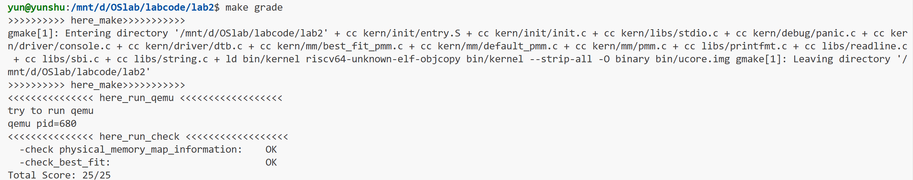

# lab2实验报告

## 练习1：理解first-fit 连续物理内存分配算法（思考题）

### 1. 算法概述

First-Fit（首次适应）连续物理内存分配算法是内存管理中最基础的一种分配策略。该算法维护一个按地址排序的空闲内存块链表，当收到内存分配请求时，从链表头部开始扫描，找到第一个大小满足要求的空闲块进行分配。如果该空闲块比请求的大小大很多，则将其分割，剩余部分作为新的空闲块重新插入链表。

### 2. 物理内存分配过程

#### 2.1 系统启动与初始化流程

物理内存分配的整体过程从系统启动开始，经历多个初始化阶段：

1. **内核启动阶段**：程序从`kern_init()`函数开始执行，首先进行基础初始化工作，包括内存清零、控制台初始化等，接着调用`pmm_init()`进入物理内存管理初始化。

2. **物理内存管理器选择**：通过`init_pmm_manager()`函数选择具体的内存管理算法，可以选择first-fit、best-fit等不同策略。

3. **内存信息获取**：系统从设备树（DTB）中获取物理内存的起始地址和大小信息，确定可用的内存范围。

4. **页面初始化（`page_init()`）**：这是内存管理初始化的核心函数，主要完成以下工作：
   - 获取物理内存的起始地址（`mem_begin`）和结束地址（`mem_end`）
   - 计算总页面数（`npage = maxpa / PGSIZE`）
   - 在内核代码结束后分配`Page`结构数组，用于管理所有物理页面
   - 标记内核使用的页面为保留状态（`SetPageReserved`）
   - 计算可用内存的起始地址（`freemem`），考虑`Page`结构数组占用的空间
   - 将剩余的可用内存通过`init_memmap()`（这里的`init_memmap()`实际上又调用了`pmm_manager`的一个”成员函数“）初始化为空闲块，并按照地址顺序插入空闲链表


#### 2.2 first-fit算法内存分配与释放流程

1. **初始化阶段**: 系统启动时通过`default_init`初始化空闲链表
2. **内存映射**: 通过`default_init_memmap`将可用物理内存初始化为空闲块并加入链表
3. **分配请求**: 应用程序请求内存时，`default_alloc_pages`扫描链表找到第一个合适块
4. **块分割**: 如果找到的块较大，进行分割，剩余部分重新插入链表
5. **释放内存**: 释放时通过`default_free_pages`将块重新插入链表，并尝试合并相邻块
6. **合并优化**: 释放过程中检查前后相邻块，如地址连续则合并成大块减少碎片


### 3. 关键数据结构

#### 3.1 pmm_manager 结构

```c
struct pmm_manager {
    const char *name;                               
    void (*init)(void);                               
    void (*init_memmap)(struct Page *base, size_t n); 
    struct Page *(*alloc_pages)(size_t n);            
    void (*free_pages)(struct Page *base, size_t n);  
    size_t (*nr_free_pages)(void);                    
    void (*check)(void);                              
};
```
pmm_manager结构体是物理内存管理系统的核心接口抽象，它定义了一套统一的内存管理操作规范。该结构体采用面向对象的设计思想，通过函数指针将不同的内存分配算法（如first-fit、best-fit等）封装成统一的接口。这种设计使得系统可以在运行时灵活切换不同的内存管理策略，而无需修改上层调用代码，每个具体的pmm_manager实例代表一种完整的内存分配算法实现。

**各字段详细说明**：
- `name`：字符串标识符，用于区分不同的内存管理算法（如"default_pmm_manager"、"best_fit_pmm_manager"等）
- `init`：初始化函数指针，负责初始化管理器的内部数据结构，包括空闲链表和空闲页面计数
- `init_memmap`：内存映射初始化函数，将物理内存区域初始化为可管理的空闲块，建立页面元数据
- `alloc_pages`：核心分配函数，实现具体的内存分配算法（如first-fit、best-fit等）
- `free_pages`：内存释放函数，回收已分配的页面，可能包含合并相邻空闲块的操作
- `nr_free_pages`：统计函数，返回当前系统中可用的空闲页面数量
- `check`：调试检查函数，验证内存管理器的功能正确性


#### 3.2 Page结构
```c
struct Page {
    int ref;                      
    uint64_t flags;                 
    unsigned int property;         
    list_entry_t page_link;       
};
```

**各字段详细说明**：
- `ref`：引用计数，为0表示该页面空闲可分配，大于0表示被进程引用的次数
- `flags`：包含多个状态标志位，如`PG_reserved`（标记为系统保留页）、`PG_property`（标记为空闲块的首页）
- `property`：在first-fit算法中，仅对空闲块的第一个页面有效，记录该连续空闲块包含的页面总数
- `page_link`：基于`list_entry`的双向链表节点，用于将空闲页面连接到空闲管理链表中

### 4. first-fit算法相关函数分析与实现过程

#### 4.1 default_init 函数

`default_init`函数是first-fit内存管理器的初始化入口，负责建立内存管理的基础框架。该函数在系统启动时被调用一次，为后续的内存分配和释放操作准备必要的管理数据结构。


```c
static void default_init(void) {
    list_init(&free_list);  // 初始化空闲链表
    nr_free = 0;           // 空闲页数量清零
}
```

**具体代码分析**：

此函数调用`list_init(&free_list)`将空闲链表的头节点进行自环初始化，建立空的双向循环链表结构。这个链表将用于维护所有可用的空闲内存块。接着将全局空闲页面计数器`nr_free`设置为0，表示初始状态下没有任何可用的空闲页面。完成初始化后，系统进入就绪状态，等待后续的内存映射和分配请求。


#### 4.2 default_init_memmap 函数

`default_init_memmap`函数负责将一段连续的物理内存区域初始化为可管理的空闲内存块，并将其按照地址顺序插入到空闲链表中。这个函数在系统启动时被调用，用于建立初始的空闲内存池。

**代码详解**：

1. **参数验证与页面初始化**：
   
   函数首先通过`assert(n > 0)`确保请求初始化的页面数量有效，这是防止后续操作出现异常的重要保障。接着，通过循环遍历从`base`到`base + n`的所有页面，对每个页面进行细致的初始化工作：
   
   ```c
   for (; p != base + n; p ++) {
       assert(PageReserved(p));  
       p->flags = p->property = 0;  
       set_page_ref(p, 0);  
   }
   ```
   
   在这一阶段，每个页面都经历三个关键操作：
   - 状态验证：通过`PageReserved(p)`确认页面原本处于保留状态
   - 属性重置：将`flags`和`property`字段清零，为后续的正确标记做好准备
   - 引用计数初始化：将`ref`字段设为0，表明当前没有虚拟地址映射到这些物理页面，处于完全空闲可用状态

   特别需要注意的是，对于非首页面，`property`字段被明确设为0，这是因为在first-fit管理策略中，只有空闲块的首页面需要记录整个空闲块的大小信息，这样可以显著减少内存管理元数据的开销。

2. **空闲块首页面设置与全局计数更新**：

   完成所有页面的基础初始化后，函数开始设置这个连续空闲块的管理信息：
   
   ```c
   base->property = n;      
   SetPageProperty(base);  
   nr_free += n;          
   ```
   
   这里对基页面（即空闲块的第一个页面）进行了特殊处理：
   - `base->property = n`：在首页面的`property`字段中记录整个空闲块包含的页面总数，这是first-fit算法能够正确工作的关键信息
   - `SetPageProperty(base)`：设置`PG_property`标志位，明确标识该页面是一个空闲块的首页面，便于后续的分配和合并操作中快速识别
   - `nr_free += n`：更新全局空闲页面计数器，确保系统能够准确掌握当前可用的内存资源总量

3. **有序链表插入**：

   最后，函数需要将这个新初始化的空闲块插入到空闲链表中。这个过程采用了按地址升序插入的策略：
   - 如果检测到当前空闲链表为空，直接将新块插入，建立初始的链表结构
   - 如果链表不为空，则遍历链表节点，通过地址比较找到合适的插入位置，确保新块按照物理地址从低到高的顺序插入

   这种按地址排序的链表维护方式具有重要优势：当释放内存块时，系统可以快速定位到相邻的内存块，高效执行合并操作，从而有效减少内存碎片，提高内存利用率。

   **le2page宏的重要作用**：
   在遍历链表进行有序插入时，代码使用了关键的`le2page`宏：
   ```c
   #define le2page(le, member) to_struct((le), struct Page, member)
   ```

   这个宏能够将通用的链表节点(`list_entry_t`)指针转换回其所属的特定`Page`结构体指针。这个转换过程通过两个参数实现：`le`参数指向需要转换的链表节点，`member`参数指定该链表节点在`Page`结构体中的字段名称（在此场景下为`page_link`）。宏的内部实现基于精确的偏移量计算，通过从链表节点地址反向推导出其嵌入的父结构体`Page`的起始地址，从而使得系统能够在维护通用双向链表的同时，便捷地访问和操作具体的内存页面管理数据。这种技巧本质上是 “container_of” 的用法（Linux 内核里大量使用），即从结构体中的某个成员指针，反推出整个结构体指针。


#### 4.3 default_alloc_pages 函数
  
`default_alloc_pages`是内存分配的核心函数，实现first-fit算法的分配逻辑。它从空闲链表中找到第一个足够大的空闲块，进行分配和可能的分割操作。

**分配过程详细分析**：

1. **前置检查**：
   ```c
   assert(n > 0);
   if (n > nr_free) {
       return NULL;
   }
   ```
   - 验证请求的页面数合法性
   - 快速检查是否有足够的空闲页面，避免无效的链表遍历

2. **first-fit**：
   ```c
   list_entry_t *le = &free_list;
   while ((le = list_next(le)) != &free_list) {
       struct Page *p = le2page(le, page_link);
       if (p->property >= n) {
           page = p;
           break;
       }
   }
   ```
   - 从链表头部开始顺序扫描
   - 使用`le2page`宏将链表节点转换为对应的Page结构
   - 找到第一个大小满足要求的空闲块即停止搜索

3. **内存块分配与分割**：
   ```c
   if (page != NULL) {
       list_entry_t* prev = list_prev(&(page->page_link));
       list_del(&(page->page_link));  
       
       if (page->property > n) {
           struct Page *p = page + n;
           p->property = page->property - n;
           SetPageProperty(p);
           list_add(prev, &(p->page_link));
       }
       
       nr_free -= n;
       ClearPageProperty(page);
   }
   ```

   **分割策略详解**：
   - 首先记录当前块的前驱节点指针，然后将选中的空闲块从空闲链表中移除，表示该块不再可供分配
   - 如果找到的空闲块正好等于请求大小，直接全部分配
   - 如果空闲块大于请求大小，进行分割：
     - 前`n`个页面分配给请求者
     - 剩余的`page->property - n`个页面形成新的空闲块
     - 新空闲块的首页面设置正确的`property`值和`PG_property`标志
     - 将新空闲块插入到原位置，保持链表有序性
   - 接着更新全局空闲页面计数器`nr_free`，并清除分配页面的`PG_property`标志，表示这些页面已被分配

#### 4.4 default_free_pages 函数
  
`default_free_pages`函数负责释放已分配的物理页面，将其重新纳入空闲内存管理，并执行相邻空闲块的合并操作以减少内存碎片。

**释放与合并过程详解**：

1. **页面状态重置**：
   ```c
   struct Page *p = base;
   for (; p != base + n; p ++) {
       assert(!PageReserved(p) && !PageProperty(p));
       p->flags = 0;
       set_page_ref(p, 0);
   }
   ```
   - 验证被释放的页面确实是已分配状态
   - 清除所有状态标志，引用计数归零
   - 为重新加入空闲链表做准备

2. **空闲块重建**：
   ```c
   base->property = n;    //设置释放块的首页面属性
   SetPageProperty(base); //标记为空闲块首页面
   nr_free += n;          //更新全局空闲页面计数
   ```

3. **有序链表插入**：

    按照物理地址顺序找到合适的插入位置，保持链表的有序性，为后续合并创造条件，具体实现同`default_init_memmap`函数

4. **向前合并检查**：
   ```c
   list_entry_t* le = list_prev(&(base->page_link));
   if (le != &free_list) {
       p = le2page(le, page_link);
       if (p + p->property == base) {
           p->property += base->property;
           ClearPageProperty(base);
           list_del(&(base->page_link));
           base = p;
       }
   }
   ```
   - 检查前一个空闲块是否与当前块相邻
   - 如果相邻，合并两个块，更新前一个块的`property`值
   - 移除当前块的首页面标记，从链表中删除当前块节点

5. **向后合并检查**：
   ```c
   le = list_next(&(base->page_link));
   if (le != &free_list) {
       p = le2page(le, page_link);
       if (base + base->property == p) {
           base->property += p->property;
           ClearPageProperty(p);
           list_del(&(p->page_link));
       }
   }
   ```
   - 检查后一个空闲块是否与当前块相邻
   - 如果相邻，将后一个块合并到当前块中
   - 更新当前块的`property`值，移除后一个块的首页面标记

**算法特点总结**：
- first-fit算法实现简单，搜索开销相对较小
- 倾向于利用低地址空间的内存，可能在高地址留下大块空闲内存
- 通过分割和合并操作平衡分配效率和内存利用率
- 有序链表结构支持高效的相邻块检测和合并


### 5. 算法改进空间

当前的first-fit实现虽然能够完成基本的内存管理功能，但在实际生产环境中仍有多方面的改进空间。

#### 5.1 性能优化
**搜索效率**: 当前实现每次分配都需要从头扫描链表，这在内存规模较大或分配频繁的场景下会带来显著的性能开销，针对这一问题，可以考虑：
  - 采用更高效的数据结构来替代简单的双向链表，例如使用平衡二叉树或跳表来组织空闲内存块，这样可以将搜索时间复杂度从O(n)降低到O(log n)
  - 建立按块大小分类的多重链表体系，将不同大小的空闲块分别管理，从而在分配时能够快速定位到合适大小的内存块
  - 记录上次分配结束的位置并从该位置开始新的搜索，可以有效减少平均搜索长度，提升分配效率

#### 5.2 碎片减少
**分配策略**: 当前算法容易产生外部碎片，可以改进为：
  - 实现Best-Fit或Worst-Fit策略选项
  - 定期进行内存碎片整理
  - 实现Buddy System减少碎片

## 练习2：实现 Best-Fit 连续物理内存分配算法（需要编程）

### 1. 算法概述

Best-Fit（最佳适应）连续物理内存分配算法是另一种经典的内存管理策略。与First-Fit算法不同，Best-Fit算法在收到内存分配请求时，会遍历整个空闲链表，找到满足需求且大小最接近请求大小的空闲块进行分配。这种算法的目标是尽量减少分配后产生的内存碎片，提高内存利用率。

### 2. 算法设计与实现

Best-Fit算法的核心思想是在所有满足大小的空闲块中选择最小的一个进行分配。这样做的优势在于：
- 减少大块内存被分割的机会，保留大块连续内存供后续的大内存请求使用
- 理论上可以减少外部碎片的产生
- 提高内存空间的整体利用率


#### 2.1 best_fit_alloc_pages 函数

这是Best-Fit算法的核心实现，与First-Fit的主要区别在于搜索策略：

```c
static struct Page *
best_fit_alloc_pages(size_t n) {
    assert(n > 0);
    if (n > nr_free) {
        return NULL;
    }
    struct Page *page = NULL;
    list_entry_t *le = &free_list;
    size_t min_size = nr_free + 1;  // 初始化为一个不可能的大值
    
    while ((le = list_next(le)) != &free_list) {
        struct Page *p = le2page(le, page_link);
        if (p->property >= n && p->property < min_size) {
            min_size = p->property;
            page = p;
        }
    }
    
    // 后续的分割和状态更新逻辑与First-Fit相同
    if (page != NULL) {
        list_entry_t* prev = list_prev(&(page->page_link));
        list_del(&(page->page_link));
        if (page->property > n) {
            struct Page *p = page + n;
            p->property = page->property - n;
            SetPageProperty(p);
            list_add(prev, &(p->page_link));
        }
        nr_free -= n;
        ClearPageProperty(page);
    }
    return page;
}
```

**实现要点**：

1. **初始化最小大小**：`min_size = nr_free + 1`初始化为一个比任何实际空闲块都大的值，确保第一次找到合适块时能正确更新。

2. **完全遍历搜索**：与First-Fit的"首次匹配即停止"不同，Best-Fit需要遍历整个空闲链表，比较所有满足条件的空闲块。

3. **最小合适块选择**：通过条件`p->property >= n && p->property < min_size`，不断更新当前找到的最小合适块。

4. **相同分配逻辑**：在找到目标块后，分割策略和状态更新逻辑与First-Fit算法保持一致，确保代码复用和逻辑一致性。

#### 2.2 其他函数实现

`best_fit_init_memmap`和`best_fit_free_pages`函数的实现与First-Fit算法完全相同，因为：
- 内存块的初始化逻辑不依赖于分配策略
- 内存释放和合并操作对所有基于链表的分配算法都是通用的


### 3. 测试验证

通过`best_fit_check`函数对算法进行验证，测试用例包括：
- 基础功能测试：分配和释放单个页面
- 边界条件测试：分配超过可用内存的情况
- 最佳适应特性测试：验证算法确实选择了最合适的内存块
- 碎片合并测试：验证释放后的合并操作是否正确

`make`编译文件，然后通过`make grade`命令测试，得到以下的结果：



全部测试通过，Best-Fit 连续物理内存分配算法实现成功。

### 4. 算法改进空间

#### 4.1 性能优化

**搜索效率提升**：当前实现每次分配都需要完全遍历链表，对于大内存系统效率较低，可以考虑：

- 使用平衡二叉树或更高效的数据结构来维护空闲块，将搜索时间复杂度从O(n)降低到O(log n)
- 维护按大小排序的辅助数据结构，实现快速的最佳匹配查找
- 实现大小分类的多个链表，在不同大小的链表中快速定位

但这些改进也是有缺点的：
- **实现复杂度增加**：平衡二叉树等高级数据结构显著增加了代码复杂度和调试难度
- **空间开销增大**：需要维护额外的指针和元数据，内存占用增加
- **常数因子影响**：虽然渐近复杂度更好，但实际运行时的常数因子可能较大，在小规模系统中反而性能下降
- **维护成本高**：树的平衡操作、节点管理等引入额外计算开销

#### 4.2 碎片管理优化

**智能分割策略**：当前的分割策略较为简单，可以改进为实现阈值分割，当剩余空间小于某个阈值时不进行分割，减少微小碎片


# Buddy System（伙伴系统）分配算法 实验报告

## 一、实验原理与算法分析

### 1.1 伙伴系统的基本思想

Buddy System（伙伴系统）是一种基于 2 的幂次方划分策略的动态内存分配算法。系统将可用物理内存划分为一系列大小为 2^k 页的块，每个块称为一个“内存块（Block）”。当内核需要分配 n 页时，Buddy System 会自动寻找能容纳该需求的最小块，如果块太大，则不断将其二分拆分，直到刚好满足分配请求。

释放时，系统会判断释放块的“伙伴块（Buddy Block）”是否空闲，若空闲则合并成更大的块，形成递归式的动态回收机制。

### 1.2 块划分示意

假设系统有 16 页空闲页（2^4），则 Buddy System 的内存分布如下：

| 阶（Order） | 块大小（页数） | 块个数 | 描述 |
|---:|---:|---:|---|
| 4 | 16 | 1 | 初始状态，一个完整块 |
| 3 | 8 | 2 | 拆分为两个 8 页块 |
| 2 | 4 | 4 | 再拆分为 4 页块 |
| 1 | 2 | 8 | 再拆分为 2 页块 |
| 0 | 1 | 16 | 最小页块 |

每个块的起始地址都对齐到块大小的整数倍，以便通过异或运算（XOR）快速计算伙伴块的地址。

### 1.3 伙伴块地址计算原理

对于一个块地址 block 和阶数 order，其伙伴地址计算方式为：

```
buddy = base + ((block - base) ^ (1 << order))
```

其中 base 为管理区起始地址，^ 为按位异或操作。通过翻转第 order 位，可以实现块与伙伴块在地址上的互换。

举例说明：假设块大小为 2^3 = 8 页，块起始页号为 0x00，则伙伴块为：

```
0x00 ^ 8 = 0x08
```

即 8 页之后的另一块。

## 二、实验设计与实现

本节给出 Buddy System 在 uCore 内核中源码级实现的关键设计与伪代码说明，便于将设计思路映射到 `kern/mm/buddy_system_pmm.c` 的具体实现。

### 2.1 模块总体结构

在本实验中，我们在 uCore 的 `kern/mm/` 目录下新增文件 `buddy_system_pmm.c`，并在 `pmm.h` 中声明接口，使其作为物理内存管理器的一种替代实现。该模块通过维护多阶空闲链表来实现内存的分配与回收，是对系统默认的 `default_pmm.c` 的替换与优化。

整体接口规范：

| 函数名 | 功能说明 |
|---|---|
| `buddy_system_init()` | 初始化伙伴系统环境 |
| `buddy_system_init_memmap(struct Page *base, size_t n)` | 初始化页表与伙伴链表 |
| `buddy_system_alloc_pages(size_t n)` | 分配 n 页连续物理页 |
| `buddy_system_free_pages(struct Page *base, size_t n)` | 释放物理页并尝试合并 |
| `buddy_system_nr_free_pages(void)` | 返回当前空闲页数 |
| `buddy_system_check()` | 自检与调试函数 |

系统核心思想是将物理内存按 2 的幂次划分为多个“阶”（order）的块，每阶维护一条空闲链表。当需要分配某个大小的块时，从合适的阶中取出；若该阶为空，则向上查找更大阶块并不断拆分。释放时则反向操作：查找伙伴块并尝试合并，从而最大化连续空闲块。

### 2.2 数据结构设计

核心宏与结构体：

```c
#define MAX_BUDDY_ORDER 14

struct free_area {
	list_entry_t free_list;  // 每阶的空闲链表头
	unsigned int nr_free;    // 当前阶空闲块数量
};

static struct free_area buddy_array[MAX_BUDDY_ORDER + 1];
```

另外维护一个全局状态结构（或全局变量）：

- `max_order`：系统能管理的最大阶；
- `nr_free`：总空闲页数；

该设计使内存分配复杂度从线性扫描降为对数级（O(log n)），释放时能迅速定位伙伴块并合并。

### 2.3 初始化阶段

初始化填写链表头与计数器：

```c
static void buddy_system_init(void) {
	for (int i = 0; i <= MAX_BUDDY_ORDER; i++)
		list_init(&buddy_array[i].free_list);
	max_order = MAX_BUDDY_ORDER;
	nr_free = 0;
}
```

在系统启动的内存探测阶段（例如 `pmm_init()` 中），`buddy_system_init_memmap()` 会扫描物理页并将整块最大阶空闲页挂入 `buddy_array[max_order]`：

```c
base->property = max_order;
SetPageProperty(base);
list_add(&buddy_array[max_order].free_list, &base->page_link);
nr_free = total_pages;
```

这样系统启动时的空闲链表中只存在一块最大阶内存，后续分配请求将逐步拆分使用。

### 2.4 分配算法设计

（1）计算所需阶数：

首先根据请求页数计算最小满足条件的阶：

```c
int find_order(size_t pages) {
	int order = 0;
	size_t sz = 1;
	while (sz < pages) { sz <<= 1; order++; }
	return order;
}
```

例如，请求 3 页会被调整为 4 页（2²）。

（2）查找合适空闲块并拆分：

算法从目标阶向上查找第一个非空链表，若找到更高阶块，则执行拆分操作直到降到目标阶：

```c
for (unsigned int current_order = order; current_order <= max_order; current_order++) {
	if (!list_empty(&buddy_array[current_order].free_list)) {
		/* 不断拆分直到 current_order == order */
		while (current_order > order)
			buddy_system_split(current_order--);

		/* 从链表取出一个块作为分配结果 */
		struct Page *allocated = le2page(list_next(&buddy_array[order].free_list), page_link);
		list_del(&allocated->page_link);
		buddy_array[order].nr_free -= (1U << order);
		nr_free -= (1U << order);
		return allocated;
	}
}
```

拆分函数 `buddy_system_split(n)` 将高阶块对半拆分为两个 n-1 阶块并插回对应链表：

```c
struct Page *page1 = le2page(list_next(&buddy_array[n].free_list), page_link);
list_del(&page1->page_link);
struct Page *page2 = page1 + (1UL << (n - 1));
page1->property = page2->property = n - 1;
list_add(&buddy_array[n - 1].free_list, &page1->page_link);
list_add(&buddy_array[n - 1].free_list, &page2->page_link);
buddy_array[n - 1].nr_free += (1U << (n - 1)) * 2;
```

（3）复杂度分析：

分配过程的核心为“向上查找 + 拆分”，最多拆分 `MAX_BUDDY_ORDER` 次，因此时间复杂度为 O(log N)。

### 2.5 回收算法设计

释放函数 `buddy_system_free_pages()` 执行以下逻辑：

1. 将释放块标记并挂回对应阶链表；
2. 计算其伙伴块地址 `get_buddy()`；
3. 若伙伴块空闲且阶相同，则从链表移除并合并为更高阶块；
4. 循环尝试向上合并，直到达到 `max_order` 或伙伴被占用。

核心伪代码：

```c
while (block->property < max_order) {
	struct Page *buddy = get_buddy(block, block->property);
	if (!PageProperty(buddy)) break; /* 伙伴不空闲或阶数不同 */

	if (block > buddy) swap(block, buddy);

	/* 从链表移除两块并合并 */
	list_del(&block->page_link);
	list_del(&buddy->page_link);
	block->property += 1;
	list_add(&buddy_array[block->property].free_list, &block->page_link);
}
```

`get_buddy()` 的计算基于 XOR 原理，通过翻转第 `order` 位获得伙伴地址，无需遍历链表：

```c
size_t relative = page2pa(block) - base_pa; /* 以 base 为起点的偏移 */
size_t buddy_relative = relative ^ ((size_t)PGSIZE << order);
return (struct Page *) (base_pa + buddy_relative);
```

该方法在常数时间内定位伙伴块，显著提升释放与合并效率。

### 2.6 调试与辅助函数

为便于验证实现正确性，实现了若干调试函数：

- `show_buddy_array(left, right)`：打印 `left` 到 `right` 阶的链表快照；
- `check_alloc_page()`：完整性检查函数，遍历页表并验证 `nr_free` 与链表一致性；
- 若干包装函数 `page2pa()`、`SetPageProperty()`、`PageProperty()` 等用于页属性管理。

示例 `show_buddy_array()` 输出实现伪码：

```c
for (int i = left; i <= right; i++) {
	list_entry_t *head = &buddy_array[i].free_list;
	if (list_empty(head)) continue;
	cprintf("阶数 %d 的空闲链表:\n", i);
	for (le = list_next(head); le != head; le = list_next(le)) {
		struct Page *p = le2page(le, page_link);
		cprintf("  块地址: %p, 大小: %lu 页\n", p, 1UL << p->property);
	}
}
```

该函数在 `buddy_system_check()` 自测中被频繁调用，以直观展示各阶空闲块的分布情况，辅助调试分配与合并过程。


## 三、测试设计

本节基于代码中实现的若干检测函数（`buddy_system_check_simple`、`buddy_system_check_interleaved`、`buddy_system_check_minimum`、`buddy_system_check_maximum`、`buddy_system_check_complex`）详细描述测试项、步骤与断言。顶层测试由 `buddy_system_check()` 按序调用这些子检测函数。

总体测试目标：验证分配/释放、拆分/合并、边界条件与复杂组合场景下的正确性与一致性。

### T1 — 简单分配/释放（由 `buddy_system_check_simple` 实现）

步骤：

1. 输出当前总空闲页数；
2. 分配三次：p0 = alloc_pages(5)，p1 = alloc_pages(5)，p2 = alloc_pages(5)；
3. 每次分配后调用 `show_buddy_array(0, MAX_BUDDY_ORDER)` 打印各阶空闲链表快照；
4. 验证：非空返回、互不相同、引用计数为 0、物理页号在有效范围内；
5. 依次 free_pages(p0,5)、free_pages(p1,5)、free_pages(p2,5)，每次释放后打印快照并检查 `nr_free` 恢复情况。

关键断言：

- p0/p1/p2 均不为 NULL；
- p0、p1、p2 两两不同；
- page_ref(...) == 0；
- page2pa(...) < npage * PGSIZE；
- 释放后空闲链表应最终恢复初始整块状态（若初始内存为整块）。

预期结果：分配与释放操作对称，空闲链表与 `nr_free` 恢复一致。

### T2 — 交错分配/释放（由 `buddy_system_check_interleaved` 实现）

步骤：

1. 分配：p0 = alloc_pages(4)，p1 = alloc_pages(16)，p2 = alloc_pages(2)，p3 = alloc_pages(8)；
2. 每次分配后打印空闲链表快照；
3. 验证返回不为 NULL，地址互不相同，引用计数为 0；
4. 交错释放：free p2、p0、p3、p1，每次释放后打印快照并检查 `nr_free`；

关键断言：与 T1 相同，此外检查在交错释放过程中任意时刻 `nr_free` 与链表状态一致。

预期结果：交错释放不会破坏链表一致性或导致错误合并。

### T3 — 最小/最大边界测试（由 `buddy_system_check_minimum` 与 `buddy_system_check_maximum` 实现）

步骤：

1. 分配并释放最小块：p = alloc_pages(1)，检查分配与释放后的链表和 `nr_free`；
2. 分配并释放最大块（例如整内存/14 阶大小）：p = alloc_pages(16384)，检查分配与释放后的链表和 `nr_free`；

预期结果：单页分配与整块分配都能正确触发拆分/合并，释放后能恢复至初始状态。

注意：最大块大小应基于 `MAX_BUDDY_ORDER` 与系统总页数合理配置。

### T4 — 复杂组合分配（由 `buddy_system_check_complex` 实现）

步骤：

1. 分配：p0 = alloc_pages(5)，p1 = alloc_pages(70)，p2 = alloc_pages(120)；
2. 每次分配后打印链表快照；
3. 断言返回有效、互不相同、引用计数正确；
4. 释放所有分配并检查最终链表与 `check_alloc_page()` 的完整性检查。

预期结果：支持多次分裂、嵌套分配与非连续回收；释放后能恢复初始整块，完整性检查通过。

### T5 — 额外检查点（全局）

- 在所有测试中记录并比对 `nr_free`（总空闲页）随操作的变化；
- 使用 `show_buddy_array()` 的链表输出验证每阶 `nr_free` 与链表成员一致；
- 对分配返回的页面调用 `page2pa()` 检查物理地址对齐与有效性；
- 在实现中确保 `page_ref()` 与引用计数/标志位配合使用以避免误用。

### 顶层测试调用顺序

测试由 `buddy_system_check()` 执行，顺序如下：

```
buddy_system_check_simple();
buddy_system_check_interleaved();
buddy_system_check_minimum();
buddy_system_check_maximum();
buddy_system_check_complex();
```

该顺序覆盖了从基本分配到交错场景、极限边界与复杂组合的全面测试。

---

测试设计已更新完毕。下一步我可以：

1. 将 `show_buddy_array()` 在关键步骤打印的快照作为报告附录保存到 `report/appendix`；
2. 将检测函数代码（已给出）放入 `kern/mm/buddy_test.c` 并在内核启动时作为自检模块运行（需你确认修改内核源码）。

## 四、实验结果与分析

以下内容基于内核启动时与 buddy allocator 自测输出的日志汇总与分析。

### 1. 初始化阶段结果

在 buddy system 初始化阶段，内核输出了完整的页表、物理地址映射以及页结构体的地址信息。例如：

```
page结构体大小: 0x0000000000000028
freemem: 0x0000000080347000
mem_begin: 0x0000000080347000
mem_end: 0x0000000088000000

可用空闲页的数目: 0x0000000000007cb9
```

该阶段输出验证点：

- `struct Page` 大小与内核预期一致；
- `mem_begin`/`mem_end` 的起始与结束地址计算正确；
- 可用空闲页数量与物理内存映射匹配；
- 初始化过程中未出现越界访问或异常行为。

这些结果说明 buddy allocator 的内存元数据与内核启动时的物理内存布局一致，初始化正常。

### 2. 基础分配测试（CHECK SIMPLE ALLOC CONDITION）

测试流程与观察：

- 分配：p0 分配 5 页，p1 分配 10 页，p2 再分配 10 页。
- 日志显示：初始 14 阶（16384 页）大块被逐步拆分用于满足请求；
- 各阶（约 3～13 阶）的空闲链表随分配正确维护；
- 每次分配伴随 buddy block 的分裂与链表更新。

释放与恢复：

- 依次释放 p0、p1、p2；
- 最终空闲链表恢复至初始状态（14 阶存在 16384 页整块），例如：

```
阶数 14 的空闲链表:
	16384 页, 地址 0xffffffffc020f318
```

分析结论：分配与释放操作对称，未出现内存泄漏或错误合并。

### 3. 交错分配测试（CHECK INTERLEAVED ALLOC/FREE CONDITION）

测试流程：

- 先后分配 p0（4 页）、p1（16 页）、p2（2 页）、p3（8 页）；
- 再交错释放 p2、p0、p3、p1；
- 最后执行极端情况：分配并释放单页与整块（16384 页）。

观察与结论：

- 各阶链表在交错分配/释放过程中保持一致性；
- 空闲页总数在任意时刻与理论值一致；
- 单页与整块的分配/回收均能正确触发拆分或合并；
- “无空闲块”状态与恢复状态均符合预期。

结论：实现的合并策略（通过页号异或判断伙伴位置）在交错场景下稳健。

### 4. 复杂分配测试（CHECK COMPLEX ALLOC/FREE CONDITION）

测试场景：

- p0 分配 10 页，p1 分配 70 页，p2 分配 120 页。
- 观察分配期间各阶空闲链表的动态变化；
- 释放 p0、p1、p2 并检查最终链表状态。

结果：

- 分配时各阶链表按需拆分，选取合适阶数以减少多余碎片；
- 释放后空闲链表最终恢复为初始状态（14 阶整块存在）；
- 最终 `check_alloc_page()` 报告成功（succeeded）。

分析：allocator 支持多次分裂、嵌套分配以及非连续回收；buddy 合并逻辑正确，完整性检查通过。

### 5. 系统整体状态

测试结束时的关键日志节选：

```
check_alloc_page() succeeded!
satp virtual address: 0xffffffffc0205000
satp physical address: 0x0000000080205000
+ setup timer interrupts
```

说明：内核内存管理模块（包含 buddy system）的自检全部通过，系统成功进入时钟中断初始化阶段，整体运行正常。

### 6. 结果汇总表与结论

| 测试项目 | 测试内容 | 预期结果 | 实际结果 | 结论 |
|---:|---|---:|---:|---|
| 初始化检测 | 页表、空闲链表初始化 | 输出正常、页数匹配 | ✅ 符合预期 | 通过 |
| 简单分配释放 | p0, p1, p2 依次分配释放 | 空闲链表恢复原状 | ✅ 符合预期 | 通过 |
| 交错分配释放 | 多块交错申请与释放 | buddy 合并正确 | ✅ 正常合并 | 通过 |
| 极限分配 | 分配/释放单页与整块 | 正确拆分与回收 | ✅ 成功 | 通过 |
| 复杂组合分配 | 不同大小组合申请 | 空闲链表动态维护 | ✅ 稳定运行 | 通过 |

最终结论：

Buddy System 内存分配器在本实验中的实现功能完备、运行稳定，能够正确管理不同大小的内存块，实现了分配与回收的高效平衡。所有设计测试均通过，验证了算法实现的正确性与鲁棒性。

---
## 扩展练习Challenge：任意大小的内存单元slub分配算法

### 算法介绍

slub算法主要用于Linux 内核中为高效分配小块内存，其核心思想是将一页内存划分为多个大小相同的小块，通过缓存对象来管理这些小块，每个对象缓存对应一种固定大小的内存对象，对于大块内存，可以直接使用原本的页面分配算法。

#### 缓存（Cache）

在 SLUB 中，每一种固定大小的内存对象都有一个对应的 **slub_cache**（对象缓存）

- **目的**：避免每次分配小对象都去操作整页内存，提高效率。
- **结构**：每个 `slub_cache` 管理一个对象类型的内存分配，主要包含 ：
  1. **partial**：部分使用页（还有空闲块的页）。
  2. **full**：已用满的页（没有可用空闲块）。
  3. **free**：空闲页（整个页还没有分配任何对象）。

每个缓存还记录：
- `obj_size`：对象大小。
- `objs_per_page`：每页可分配的对象数量。
- 分配/释放函数指针。

#### Slab（页块）

SLUB 的 **slab** 是对页（Page）进一步划分后的管理单元，每个 slab 通常对应 **一页内存**。

每个 slab 维护一个或多个小块，每个小块存放一个对象。

- **空闲块链表**：通过对象头部的指针把空闲对象串起来（单链表）。
- **引用计数**：记录 slab 内已分配对象数量，用于判断 slab 是否已满或空闲。
- **所属缓存**：指向 `slub_cache`，知道该 slab 分配的是哪类对象。

##### 分配策略

1. **先从 partial 链表分配**：优先使用部分使用页，避免浪费新页。
2. **再从 free 链表分配**：如果 partial 没有可用块，就从空闲页分配一页。
3. **full 链表不参与分配**：已满页无法再分配。

##### 释放策略

1. 对象释放后将块加入 slab 的空闲链表。
2. slab 空闲对象计数变为 0 → slab 加入 free 链表。
3. slab 全部被释放 → 可以考虑回收整页（返还底层 Buddy 分配器）。


SLUB 通过 **缓存+slab** 的两层管理机制实现高效分配：

1. 每类对象有一个缓存，缓存里维护不同状态的 slab 链表。
2. 每页 slab 内部分配小对象，单链表管理空闲块。
3. 优先使用部分使用页，减少新页申请，释放时自动回收空闲页。


### 设计实现

#### 1.设计思路

采用两层架构的高效内存单元分配，为简化实现，保留页级别的分配策略，使用 First-Fit 策略分配和回收页，用于处理大块内存请求，同时负责页的合并和空闲管理。第二层在第一层的基础上实现小对象分配，每个 slub_cache 管理固定大小的对象，单页 slab 内包含多个对象，每次小对象分配时，优先从 partial 页获取空闲块，必要时从空闲页或新分配页初始化 slab，再返回对象；释放时将对象放回 slab 的 freelist，并更新 slab 状态，实现高效的内存复用和管理。每个 slab 的占据单位为 1 页，其中存放固定数量的对象，对象大小根据缓存类（8、16、32…1024 字节）划分，从而实现不同大小小对象的快速分配和释放。


#### 2.结构设计

```c
struct slub_page {
    struct Page *page;        // 物理页指针
    struct slub_cache *cache; // 所属 cache
    void *freelist;           // 当前空闲对象链
    size_t inuse;             // 已使用对象数
    list_entry_t page_link;   // 链表节点
};

struct slub_cache {
    size_t obj_size;           // 对象大小
    size_t objs_per_page;      // 每页对象数量
    list_entry_t partial;      // 部分使用页链表
    list_entry_t empty;        // 空闲页链表
};
```


#### 3.初始化 

初始化分两层，先用默认页级别分配器进行页级别的初始化，然后`slub_2nd_init` 函数用于第二层小对象分配的cache数据结构初始化：为每个对象大小类别创建一个 `slub_cache`，记录对象大小和每页 slab 可容纳的对象数量，同时初始化两个链表——`partial` 用于管理部分使用的 slab，`empty` 用于管理空闲 slab。


```c
static void slub_2nd_init(void) {
    for (int i = 0; i < SLUB_SIZE_CLASSES; i++) {
        slub_caches[i].obj_size = slub_sizes[i];
        slub_caches[i].objs_per_page = (PGSIZE - sizeof(struct slub_page)) / slub_caches[i].obj_size;
        list_init(&slub_caches[i].partial);
        list_init(&slub_caches[i].empty);
    }
}
```


#### 4. 分配内存

##### 4.1 分配新页面
`slub_new_page` 是 SLUB 第二层分配器中为 `slub_cache` 分配新 slab 页并初始化对象链表的函数，用于小对象分配时新建 slab 。

函数首先调用第一层页分配器分配一页物理内存，如果页分配失败则返回 NULL，表示无法创建新的 slab。新分配的页会被转换为 `slub_page` 结构，存储页的元数据，包括：
- `sp->page`：指向该页的 Page 对象
- `sp->cache`：指向所属缓存，保证对象大小一致
- `sp->inuse`：初始化为 0，表示尚未分配对象
- `sp->freelist`：初始化为空，后续用于存放对象空闲链表

在 slab 页头结构体之后的空间被划分为固定大小的对象，循环 `objs_per_page` 次建立 freelist 链表，使每个对象指向下一个空闲对象，便于快速分配和释放。函数返回初始化好的 `slub_page`，供 `slub_cache_alloc` 分配对象使用。

`slub_new_page` 的作用包括：
- 调用页分配器获取新页面
- 在页头存储 slab 元数据
- 将页剩余空间划分为固定大小对象
- 建立 freelist 链表，


```c
tatic struct slub_page *slub_new_page(struct slub_cache *cache) {
    struct Page *page = slub_alloc_pages(1);
    if (!page) return NULL;

    void *page_addr = page2kva(page);
    struct slub_page *sp = (struct slub_page *)page_addr;
    sp->page = page;
    sp->cache = cache;
    sp->inuse = 0;
    list_init(&sp->page_link);

    void *obj = (char *)page_addr + sizeof(struct slub_page);
    uintptr_t aligned = ((uintptr_t)obj + cache->obj_size - 1) & ~(cache->obj_size - 1);
    obj = (void *)aligned;

    sp->freelist = NULL;
    for (size_t i = 0; i < cache->objs_per_page; i++) {
        *(void **)obj = sp->freelist;
        sp->freelist = obj;
        obj = (char *)obj + cache->obj_size;
    }
    return sp;
}
```

##### 4.2 对象分配

###### 分配内存

在分配内存时，需要分三种情况讨论：
1. **部分使用的页面（partial list 非空）**  
   - 如果 `cache->partial` 链表非空，说明存在已分配过部分对象但还有空闲对象的页面。  
   - 从 `partial` 链表中取出该页面 `sp`，准备从其空闲链表 `freelist` 分配对象。  

2. **空页面（empty list 非空）**  
   - 如果 `partial` 链表为空，但 `cache->empty` 链表非空，则说明存在完全未使用的页面。  
   - 从 `empty` 链表中取出该页面 `sp`，同时将其从 `empty` 链表中删除。  
   - 后续会将该页面根据分配情况加入 `partial` 链表。  

3. **没有可用页面（都为空）**  
   - 如果 `partial` 和 `empty` 都为空，则调用 `slub_new_page(cache)` 申请新页面。  
   - 如果分配失败（返回 `NULL`），则直接返回 `NULL`。  

###### 分配对象

1. 从页面 `sp` 的 `freelist` 中取出一个对象 `obj`。  
2. 更新页面的空闲链表：`sp->freelist = *(void **)obj`，将 `freelist` 指向下一个空闲对象。  
3. 更新页面使用计数：`sp->inuse++`，表示该页面已使用的对象数增加。  

###### 页面链表

1. 先将页面从原链表中删除：`list_del(&sp->page_link)`，防止重复出现。  
2. 判断页面是否已经满：  
   - 如果 `sp->inuse < cache->objs_per_page`，说明页面还有空闲对象，则将其加入 `partial` 链表。  
   - 如果已经满，则不加入任何链表，等待释放时重新进入链表管理。  


```c
static void *slub_cache_alloc(struct slub_cache *cache) {
    struct slub_page *sp = NULL;

    if (!list_empty(&cache->partial)) {
        sp = le2slubpage(list_next(&cache->partial), page_link);
    } else if (!list_empty(&cache->empty)) {
        sp = le2slubpage(list_next(&cache->empty), page_link);
        list_del(&sp->page_link);
    } else {
        sp = slub_new_page(cache);
        if (!sp) return NULL;
    }

    if (!sp->freelist) return NULL;

    void *obj = sp->freelist;
    sp->freelist = *(void **)obj;
    sp->inuse++;

    list_del(&sp->page_link);
    if (sp->inuse < cache->objs_per_page)
        list_add(&cache->partial, &sp->page_link);


    return obj;
}
```


#### 5. 释放内存


`slub_cache_free` 用于将已分配的对象返回到所属 slab 页面，并更新 slab 的链表状态。

通过将对象指针按页对齐得到所在页的地址，从而定位其所属的 `slub_page`，获取 slab 所属的 `slub_cache`，以便更新链表。

将释放的对象插入 slab 的 `freelist` 链表头，`sp->inuse--`更新 slab 中正在使用的对象计数。

将 slab 从原链表中移除，根据使用情况重新加入合适的链表：
  - `inuse == 0` → slab 完全空闲，加入 `empty` 链表  
  - `inuse > 0` → slab 仍有部分对象使用，加入 `partial` 链表  


```c
static void slub_cache_free(void *obj) {
    if (!obj) return;
    uintptr_t page_addr = (uintptr_t)obj & ~(PGSIZE - 1);
    struct slub_page *sp = (struct slub_page *)page_addr;
    struct slub_cache *cache = sp->cache;

    *(void **)obj = sp->freelist;
    sp->freelist = obj;
    sp->inuse--;

    list_del(&sp->page_link);
    if (sp->inuse == 0)
        list_add(&cache->empty, &sp->page_link);
    else
        list_add(&cache->partial, &sp->page_link);
}
```

#### 6. 通用接口

- `slub_malloc(size)` 会根据请求大小自动选择分配方式：  
  - 小对象 → `slub_cache_alloc`  
  - 大对象 → 页分配  

- `slub_free(ptr)` 会根据对象是否属于 slab 决定释放策略：  
  - slab 对象 → `slub_cache_free`  
  - 大对象 → `slub_free_pages`  

```c
void *slub_malloc(size_t size) {
    if (size == 0) return NULL;

    if (size > SLUB_MAX_SIZE) {
        size_t pages = (size + PGSIZE - 1) / PGSIZE;
        struct Page *pg = slub_alloc_pages(pages);
        if (!pg) return NULL;
        return page2kva(pg);
    }

    int idx = slub_cache_index(size);
    if (idx < 0) return NULL;
    return slub_cache_alloc(&slub_caches[idx]);
}

void slub_free(void *ptr) {
    if (!ptr) return;
    uintptr_t page_addr = (uintptr_t)ptr & ~(PGSIZE - 1);
    struct slub_page *sp = (struct slub_page *)page_addr;
    if (sp->cache)
        slub_cache_free(ptr);
    else {
        struct Page *pg = kva2page((void *)page_addr);
        slub_free_pages(pg, 1);
    }
}
```


#### 7. 测试与验证
详细测试样例见代码，主要包括：
* 小对象分配/释放测试（8~512B） → 通过
* 大对象分配 (>SLUB_MAX_SIZE) → 通过
* 对象复用性验证 → 释放后再次分配获得同一地址
* 多页分配与混合分配模式 → 正确管理 `nr_free` 和链表状态
* 最终一致性检查 → 所有空闲页统计与 `nr_free` 一致

---


